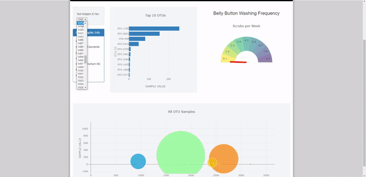

# plotly - Microbe Diversity

Interactive dashboard that explores the Belly Button Biodiversity dataset, which catalogs the microbes that colonize human navels.  A dropdown menu of individuals in the study updates a table and multiple plots when a new sample is selected.  The dashboard is hosted by GitHub Pages here:

https://stuhunter4.github.io/plotly_microbe_diversity/plotly/index.html

The dataset reveals that a small handful of microbial species (called operational taxonomic units, or OTUs, in the study) were present in more than 70% of people, while the rest were relatively rare.

The top 10 OTUs found in an individual are displayed by the horizontal bar chart.  The entirety of OTUs are displayed through the bubble chart.  In addition, the individual's demographic information is displayed in a small table, while their weekly washing freqency is displayed by the gauge chart.

